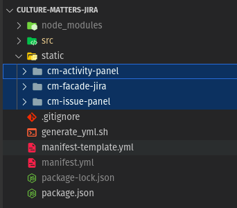

# Front-end

The Front-end is written using React and  Forge

Forge is a cloud development platform created by Atlassian. It allows developers to create,host,and manage Cloud-based applications. &#x20;

## prerequisites

1. node.js version ^12
2. NPM

## Packages to keep into consideration

1. <mark style="color:red;">reactflow</mark>    <mark style="color:blue;">https://reactflow.dev/</mark>
2.  <mark style="color:red;">react-beautiful-dnd</mark>    <mark style="color:blue;">https://www.npmjs.com/package/react-beautiful-dnd</mark>


It uses three React apps

1. cm-activity-panel
2. cm-facade-jira
3. cm-issue-panel

All these three are located under <mark style="color:red;">./static</mark>



For handling the store we are using the package called as Mobx.


## Development cycle

When a developer pulls the code for the first time, They can refer to the [README.md](http://readme.md/) file in order to set up their machine locally

**Useful Commands:**

```
npm install # This install all the nessesary packages needed for the Application

npm run build # Create the build folder located at ./build

npm start  # Run the server without creating a build file
```

## Branching structure

1. <mark style="color:red;">dev</mark>: This branch is the development branch that gets deployed to the Dev instance and the branch from where the devs would cut branches for fixes/features.
2. <mark style="color:red;">staging</mark>: This is the staging branch where the latest dev branch would get merged and deployed to the staging environment
3. <mark style="color:red;">main</mark>: This is the production branch where the latest release branch would get merged and deployed to the production environment

While working in a fast-paced development cycle, it is always recommended to run the trunk-based strategy for the developers, That is if there is any hotfix/feature branch that is cut from <mark style="color:red;">dev</mark>, after the code is all committed and pushed to the respective feature branch, always rebase that branch with <mark style="color:red;">dev</mark> and clear all conflicts and force push. Once pushed, test out all the affected areas before putting out a PR

## DevOps

For the Front-end we don't need a hosting setup, Because all these things are handled by the jira Itself\
&#x20;&#x20;

**Useful Commands for deployment**

1. <mark style="color:red;">forge deploy :</mark>  for development deployment&#x20;
2. <mark style="color:red;">forge deploy -e production</mark> : for production deployment

&#x20;

##


##
